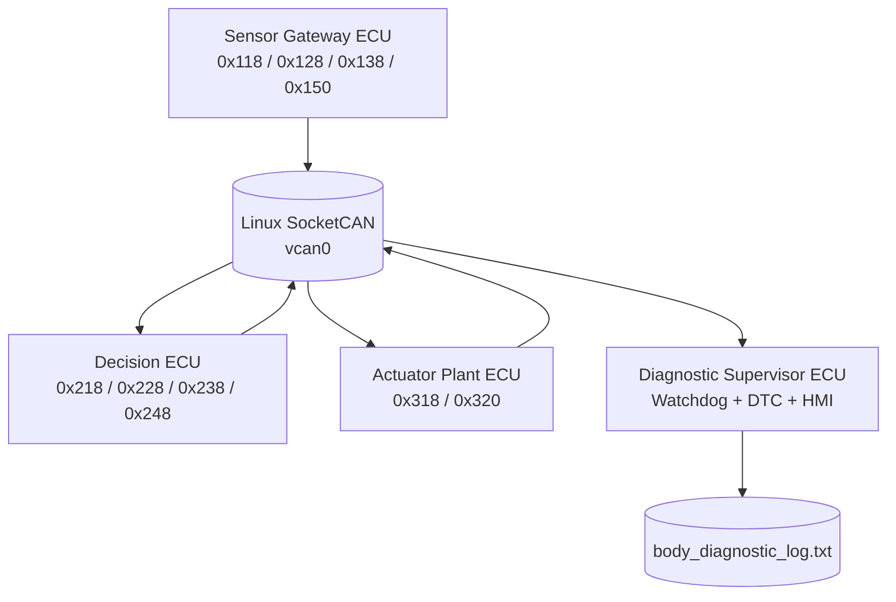
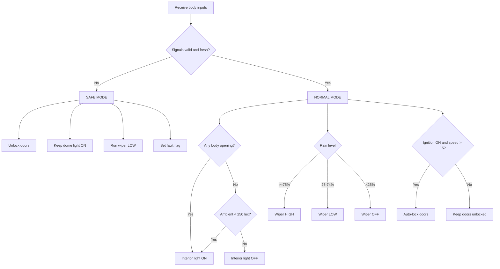

# Alternate Distributed Vehicle Body Control System over Linux SocketCAN

## 1. System Design Report

### 1.1 Problem Description and Scope

This repository implements a distributed automotive Body Control Module demonstrator using four independent Linux C processes connected through SocketCAN on `vcan0`. The design separates sensing, deterministic control decisions, actuator simulation, and diagnostic supervision.

The body-domain functions are door/contact monitoring, ambient-light evaluation, rain-responsive wiper control, ignition/speed-based automatic locking, interior-light control, actuator feedback, electrical fault reporting, watchdog supervision, and safe-state handling.

### 1.2 System Objectives

- Use native `PF_CAN` / `SOCK_RAW` / `CAN_RAW` sockets.
- Keep every ECU independently executable.
- Use both periodic and event-triggered message semantics.
- Detect out-of-range values rather than silently clamping them.
- Enter a deterministic safe mode whenever critical validity or communication conditions fail.
- Maintain a diagnostic record using immediate `fflush()` calls.
- Provide a live console HMI from an ECU that does not own the BCM control decisions.
- Build cleanly with `gcc -Wall -Wextra -pedantic -std=c11 -O2`.

### 1.3 Functional Architecture



### 1.4 Control State Flow



### 1.5 CAN Communication Matrix

| CAN ID | Message | Tx ECU | Rx ECU(s) | Type | DLC | Timing / Trigger |
|---:|---|---|---|---|---:|---|
| `0x118` | Body Contact Snapshot | Sensor | Controller, Diagnostic | Periodic | 4 | 100 ms |
| `0x128` | Light/Rain Report | Sensor | Controller, Diagnostic | Periodic | 4 | 100 ms |
| `0x138` | Ignition/Speed Report | Sensor | Controller, Diagnostic | Periodic | 4 | 100 ms |
| `0x150` | Sensor Gateway Heartbeat | Sensor | Diagnostic | Periodic | 2 | 5 s |
| `0x218` | Cabin Light Command | Controller | Actuator, Diagnostic | Periodic command | 2 | 250 ms |
| `0x228` | Central Lock Command | Controller | Actuator, Diagnostic | Periodic command | 2 | 250 ms |
| `0x238` | Wiper Command | Controller | Actuator, Diagnostic | Periodic command | 2 | 250 ms |
| `0x248` | BCM Mode/Status | Controller | Actuator, Diagnostic | Periodic | 3 | 250 ms |
| `0x318` | Physical Actuator Feedback | Actuator | Diagnostic | Periodic | 4 | 500 ms |
| `0x320` | Actuator Fault Event | Actuator | Diagnostic | Event | 2 | On error |

### 1.6 Signal Encoding Specification

| Signal | CAN ID | Byte | Encoding | Valid Range | Safe Value |
|---|---:|---:|---|---|---|
| Front-right door | `0x118` | 0 | Boolean | 0/1 | 0 |
| Rear-right door | `0x118` | 1 | Boolean | 0/1 | 0 |
| Trunk contact | `0x118` | 2 | Boolean | 0/1 | 0 |
| Door metadata/fault | `0x118` | 3 | bits 0-3 count, bit7 fault | count 0-3, bit7 normally 0 | 0 |
| Ambient light | `0x128` | 0-1 | uint16, 1 lux/bit | 0-50000 lux | 500 lux |
| Rain level | `0x128` | 2 | uint8, 1%/bit | 0-100% | 0% |
| Sensor flags | `0x128` | 3 | bitfield | 0-255 | 0 |
| Ignition | `0x138` | 0 | Boolean | 0/1 | 0 |
| Vehicle speed | `0x138` | 1 | uint8, 1 km/h/bit | 0-200 km/h | 0 |
| Vehicle-state flags | `0x138` | 2 | bitfield | 0-255 | 0 |
| Sensor sample index | `0x138` | 3 | uint8 counter | 0-255 | 0 |
| Light mode | `0x218` | 0 | 0=off,1=dome,2=ambient | 0-2 | 1 |
| BCM mode | `0x218` | 1 | 0=run,1=safe | 0-1 | 1 |
| Lock command | `0x228` | 0 | 0=unlock,1=lock | 0-1 | 0 |
| Controller fault | `0x228` | 1 | Boolean | 0/1 | 1 |
| Wiper level | `0x238` | 0 | 0=off,1=low,2=high | 0-2 | 1 |
| Rain copy | `0x238` | 1 | uint8 % | 0-100% | 0 |
| BCM mode | `0x248` | 0 | enum | 0-1 | 1 |
| BCM fault | `0x248` | 1 | Boolean | 0/1 | 1 |
| Ignition copy | `0x248` | 2 | Boolean | 0/1 | 0 |
| Lock feedback | `0x318` | 0 | Boolean | 0/1 | 0 |
| Light feedback | `0x318` | 1 | enum | 0-2 | 1 |
| Wiper feedback | `0x318` | 2 | enum | 0-2 | 1 |
| Safe feedback | `0x318` | 3 | Boolean | 0/1 | 1 |
| Actuator fault flags | `0x320` | 0 | bitfield | 0-7 | 0 |
| Fault sequence | `0x320` | 1 | uint8 counter | 0-255 | 0 |

### 1.7 Automotive Control Rules

The alternate controller implements the following deterministic rules:

1. Any active door/trunk contact turns the dome light on.
2. When there are no open contacts, ambient light below 250 lux requests the ambient cabin-light mode.
3. Rain at or above 25% selects LOW wiper speed; rain at or above 75% selects HIGH.
4. Ignition ON together with speed above 15 km/h requests automatic door locking.
5. Invalid signal ranges or a supervised input older than 5 seconds cause SAFE MODE.
6. SAFE MODE commands unlocked doors, dome light ON, and wiper LOW.

### 1.8 Fault-Injection Modes

The sensor ECU supports:

```text
--fault-light
--fault-rain
--fault-door
--fault-speed
```

Examples:

```bash
./body_sensor_ecu --fault-rain
./body_sensor_ecu --fault-light
./body_sensor_ecu --fault-door
./body_sensor_ecu --fault-speed
```

The actuator ECU additionally supports:

```bash
./body_actuator_ecu --fault-actuator
```

### 2. Test and Verification Report

#### 2.1 Environment

Required host environment:

- Linux kernel with SocketCAN and `vcan` support
- GCC
- GNU Make
- `iproute2`
- `can-utils` is recommended for `candump`

#### 2.2 Test Matrix

| ID | Test | Procedure | Expected Result |
|---|---|---|---|
| TC1 | Normal distributed operation | Start all four ECUs without faults | Frames circulate, BCM changes outputs according to doors/light/rain/speed |
| TC2 | Light/rain invalid value | Run sensor with `--fault-light` or `--fault-rain` | Diagnostic log records sensor DTC and BCM enters SAFE |
| TC3 | Invalid door payload | Run sensor with `--fault-door` | Door payload DTC appears, lock output becomes unlock, dome light stays ON |
| TC4 | Sensor node loss | Stop the sensor ECU for more than 5 s | Diagnostic ECU reports one or more watchdog DTCs |
| TC5 | Hot recovery | Restart the sensor ECU | Watchdog clears on receipt, BCM returns to valid-state decisions when values are healthy |
| TC6 | Actuator fault | Start actuator with `--fault-actuator` | `0x320` fault events are logged by diagnostic ECU |

#### 2.3 Example Diagnostic Records

```text
2026-08-23 22:10:00 | S-SENSE | Environment signal out of range
2026-08-23 22:10:05 | WD02 | ENV frame 0x128 missing for more than 5 seconds
2026-08-23 22:10:06 | A-ELEC | Actuator electrical/status fault reported
```

Actual timestamps depend on execution.

#### 2.4 Design Rationale

This version intentionally separates sensor heartbeat traffic from application values. That provides a clearer way to distinguish "no sensor process" from "sensor process alive but data invalid" during troubleshooting. The controller also uses explicit BCM modes rather than directly storing a boolean safe flag as its primary state variable.

# 3. Build and Execute

## 3.1 Create the Virtual CAN Bus

```bash
cd Vehicle-Body-Control-SocketCAN-Friend
chmod +x setup_vcan.sh run_system.sh
./setup_vcan.sh vcan0
```

Check:

```bash
ip -details link show vcan0
```

## 3.2 Compile Everything

```bash
make clean
make
```

Or:

```bash
make verify
```

## 3.3 Start Four ECUs Manually

Terminal 1:

```bash
./body_diagnostic_ecu --interface vcan0 --log body_diagnostic_log.txt
```

Terminal 2:

```bash
./body_controller_ecu --interface vcan0
```

Terminal 3:

```bash
./body_actuator_ecu --interface vcan0
```

Terminal 4:

```bash
./body_sensor_ecu --interface vcan0
```

## 3.4 Start the Complete System Automatically

```bash
./run_system.sh vcan0
```

Logs will be placed in:

```text
runtime/sensor.log
runtime/controller.log
runtime/actuator.log
runtime/diagnostic.log
```

## 3.5 Observe CAN Frames

Open another terminal:

```bash
candump vcan0
```

You should see traffic involving the alternate message IDs such as `118`, `128`, `138`, `218`, `228`, `238`, `248`, `318`, and `320`.

# 4. GitHub Deployment

Replace `GITHUB_USERNAME` and `REPOSITORY_NAME` with the friend's real account/repository.

```bash
git init
git branch -M main
git add .
git commit -m "Create alternate distributed BCM SocketCAN implementation"
git remote add origin https://github.com/GITHUB_USERNAME/REPOSITORY_NAME.git
git push -u origin main
```

Using GitHub CLI:

```bash
gh auth login
gh repo create GITHUB_USERNAME/REPOSITORY_NAME --public --source=. --remote=origin --push
```

# 5. Submission Checklist

- [ ] Four `.c` files compile with the required GCC flags.
- [ ] `README.md` contains architecture, CAN matrix, signal table, diagrams, test cases, and execution commands.
- [ ] `setup_vcan.sh` creates the virtual interface.
- [ ] `run_system.sh` starts all four ECUs.
- [ ] `body_diagnostic_log.txt` is generated during testing.
- [ ] Normal `candump vcan0` traffic is visible.
- [ ] At least one sensor fault is demonstrated.
- [ ] Five-second node-loss timeout is demonstrated.
- [ ] Recovery is demonstrated by restarting the sensor ECU.
- [ ] GitHub repository contains only the friend's final version.
